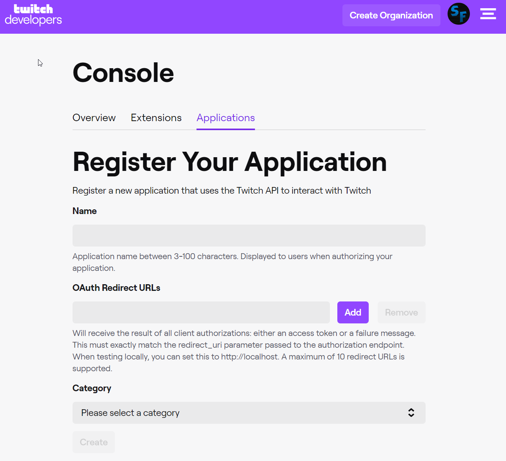
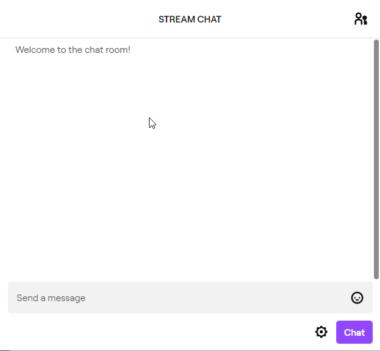

I have always wanted to try this "live streaming" thing out for a while now. After a couple of tries over the years, I am committed to stream consistently on Twitch and have been for a couple weeks now. Since I am mainly going to be streaming my programming sessions and also talk tech, I needed to brainstorm personal projects for me to do on stream. Thus, I decided to create my own twitch bot for my twitch stream called "SnowForgeBot". 

This idea/inspiration came from a fellow twitch streamer in the Science & Technology catagory called [Adam13531](https://www.twitch.tv/adam13531). Besides being a tremendous motivation to code in general, he has built himself a twitch bot with features such as changing bot responses to commands like `!today` which gives the viewer insight into what he is working on that day. Even though he does a phenomenal job with intracting with his chat, the bot acts as a helping hand in the intraction with the viewers, helping retain and attract more to his channel. 

For this twitch bot, I am using a Python library called `IRC` to help with all of the IRC message parsing (Here is a [link](https://github.com/twitchdev/chat-samples/tree/master/python) to an example bot written in python by TwitchDev). Below class definition and constructor from the linked example.
```python
import irc.bot
class TwitchBot():
    def __init__(self, username, client_id, token, channel):
        self.client_id = client_id
        self.token = token
        self.channel = '#' + channel

        url = 'https://api.twitch.tv/kraken/users?login=' + channel
        headers = {'Client-ID': client_id, 'Accept': 'application/vnd.twitchtv.v5+json'}
        r = request.get(url, header=headers).json()
        self.channel_id = r['users'][0]['_id']

        server = 'irc.chat.twitch.tv'
        port = 6667
        irc.bot.SingleServerIRCBot.__init__(self,[(server, port, 'oauth:'+token)], username, username)

```
To create your own bot, you'll need to create a brand new account for the bot, generate a OAuth token to login into IRC, and get the Client ID of the application. An OAuth token can be generated by going to this link [here](https://twitchapps.com/tmi/). Once you have a generated token, you should be able to go to [dev.twitch.com](https://dev.twitch.tv/) and register a new application to use that OAuth token. Clicking on the Overview tab will show you your new registered application and the Client ID associated with the application. Both the OAuth token and Client ID are required when using Twitch's API as shown above. For more information about the usage of the Twitch API, go [here](https://dev.twitch.tv/docs/).



First, I implement some basic features such as giving out links to my social media accounts, invite link to the community discord server, and what my current stream schedule is just to name a few. After that, I started to add features were I could change the bots response from chat itself, sort of like `GET` or `SET` functions in a class. One of the command that uses this idea is `!today` and `!project`. By typing `!today set I am doing more bot development` for example, would change the response of the bot to now say `I am doing more boy development` whenever the !today command is called by a viewer. Something so trival and simple, is very powerful, giving the viewer the information they need to understand what is going on and to be engaged in the stream. Another way to accomplish this is to "at" someone in chat about the command, for example `!today foobar` with the response being `@foobar -> I am doing more bot development`.



If you go to my [Twitch channel](https://www.twitch.tv/thesnowforge), you'll be able to use SnowForgeBot. Currently, I have the application constantly running on a Raspberry Pi 3 that resides underneath my main computer monitor.


Since I am still very new to this live streaming thing, I don't want to spend all my time making features that won't be useful for me. Instead, I plan on adding features as time goes on and my community grows as well. Some future features to add to this bot be adding a localize database and track when the last time a user was in the chat room, leaderboard for most interactive viewer in chat, and commands to change the RGB lights in my room (this idea might come sooner than later tbh). 
